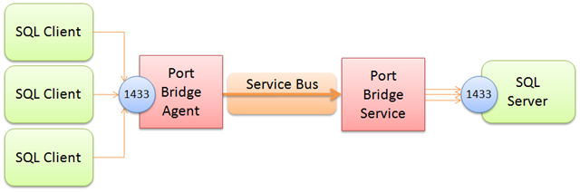

# Port Bridge

"Port Bridge" is a point-to-point tunneling utility that allows mapping 
TCP listener ports and named pipes from some machine on network A 
to another machine on a different network B, and make it appear as if the 
listener were local on network B. 

> This samples was originally built for the WCF Relay in 2009 (!) and
> has been adapted for the new Azure Relay Hybrid Connections Public Preview.
> The sample was built far before the Task-based async programming model was 
> introduced and therefore uses the classic async callback model.  

PortBridge is similar to what can generally be achieved via SSH tunneling, but
is realized over the Relay so that both parties can reside safely behind Firewalls,
leverage the Service Bus authorization integration, and have all communication run
over the Firewall-friendly WebSocket protocol. 

## How it works      

Port Bridge consists of two components, the "Port Bridge Service" and the 
"Port Bridge Agent". 

The Agent’s job is to listen for and accept TCP or Named Pipe connections on a
configurable port or local pipe name. The Service’s job is to accept for
incoming connections from the Agent, establish a connection with the Agent,
and pump the data from the Agent to the actual listening service – and vice
versa. 



It’s actually quite simple. In the picture above you see that the Service
is configured to connect to a SQL Server listening at the SQL Server default
port 1433 and that the Agent – running on a different machine, is listening on
port 1433 as well, thus mapping the remote SQL Server onto the Agent machine as
if it ran there. You can (and I think of that as to be more common) map the
service on the Agent to any port you like – say higher up at 41433.

In order to increase the responsiveness and throughput for protocols that are
happy to kill and reestablish connections frequently such as HTTP, "Port Bridge"
always multiplexes concurrent socket connections between two parties over the
same relayed connection.  

When using Port Bridge to bridge to a remote HTTP proxy that the Service machine
can see, but the Agent machine can’t see, there are very many and very
short-lived connections being tunneled through the channel. Creating a new
Hybrid Connection channel for each of these connections is feasible – but not very
efficient. 

## How do I use it?

This is a code sample and thus you’ll have to build it using Visual Studio 2015.
At present, the sample depends on the Windows version of the .NET Framework. During 
the public preview, the sample will eventually also work for .NET Core. 

There are three code projects: 
* PortBridgeServerAgent implementing the service side forwarding connections to the configured targets
* PortBridgeClientAgent implementing the client side accepting connections and mapping them through the Relay
* PortBridge assembly containing the bulk of the logic for Port Bridge. 

### Service

The service’s exe file is "PortBridge.exe" and is both a console app and a
Windows Service. If the Windows Service isn’t registered, the app will always
start as a console app. If the Windows Service is registered (with installutil.exe), 
you can force console-mode with the –c command line option.

The app.config file on the Service Side (PortBridge/app.config,
PortBridge.exe.config in the binaries folder) specifies what ports or named
pipes you want to project into Service Bus:

``` XML
  <portBridge serviceBusNamespace="mynamespace.servicebus.windows.net" 
              serviceBusAccessRuleName="RootManageSharedAccessKey" 
			  serviceBusAccessRuleKey="xxxxxxxx">
    <hostMappings>
      <add targetHost="myhost" allowedPorts="3389" />
    </hostMappings>
  </portBridge>
```

The serviceBusNamespace attribute takes your Service Bus namespace name, and the
serviceBusAccessRuleName and serviceBusAccessRuleKey attributes are set to the 
SAS rule you want to use. 

The hostMappings section contains a list of hosts and rules for what you want to
project out to Service Bus. Each added entry can have the following attributes:

* _targetHost_ (required): The targetHost value identifies the host to which the 
  connection shall be forwarded. This name must be resolvable on the network on
  which the server agent runs. 
* _allowedPorts_: This value defines which ports may be accessed on
 the target host through this bridge. The permitted values are a list of command
 separated numbers. The value '*' permits use of all ports.
* _allowedPipes_: This value defines which named pipes may be accessed on the target
 host through this bridge. The permitted values are a list of comma separated pipe 
 names. The value '*' permits use of all pipes.  

> IMPORTANT: You must explicitly create a Hybrid Connection on the Relay namespace 
> (via API or Portal) for each listed _targetHost_ that has the same name as the 
> _targetHost_. Hybrid Connection names may include dots. Mappings to the local 
> machine may not be identified as "localhost"; they must use the machine's name    

All inbound connections to the endpoints generated from the host mappings
section are protected by Service Bus and require a token that grants access to
your namespace. If you open up port 3389 (Remote Desktop) through your firewall and
NAT, everyone can walk up to that port and try their password-guessing skills.
If you open up port 3389 via Port Bridge, you first need to get through the
Service Bus access control gate before you can even get at the remote port.

Examples:

``` XML
<add targetHost="mybox" allowedPorts="3389" /> 
project the local machine into Service Bus and only allow Remote Desktop (3389)

<add targetHost="mybox" allowedPorts="3389,1433" /> 
project the local machine into Service Bus and allow Remote Desktop (3389) and SQL Server TDS (1433)

<add targetHost="mybox" allowedPorts="*" /> 
project the local machine into Service Bus and only allow any TCP port connection

<add targetHost="mybox" allowedPipes="sql/query" /> 
project the local machine into Service Bus and allow no TCP connections but all named pipe connections to \.\pipes\sql\query

<add targetHost="otherbox" allowedPorts="1433" /> 
project the machine "otherbox" into Service Bus and allow SQL Server TDS connections via TCP
```

### Agent

The client agent and is also both a console app and a Windows Service.

The app.config file on the Agent side specifies which ports or
pipes you want to project into the Agent machine and whether and how you want to
firewall these ports. The firewall rules here are not interacting with your
local firewall. This is an additional layer of protection.

``` XML
  <portBridgeAgent serviceBusNamespace="mynamespace.servicebus.windows.net" 
                   serviceBusAccessRuleName="RootManageSharedAccessKey" 
                   serviceBusAccessRuleKey="xxxxxxxx">
    <portMappings>
      <port localTcpPort="13389" targetHost="mybox" remoteTcpPort="3389">
        <firewallRules>
          <rule source="127.0.0.1" />
          <rule sourceRangeBegin="10.0.0.0" sourceRangeEnd="10.255.255.255" />
        </firewallRules>
      </port>
    </portMappings>
  </portBridgeAgent>
```

Again, the serviceBusNamespace attribute takes your Service Bus namespace name,
and serviceBusAccessRuleName plus serviceBusAccessRuleKey the SAS rule information.

The portMappings collection holds the individual ports or pipes you want to
bring onto the local machine. Shown above is a mapping of Remote Desktop (port
3389 on the machine with the computer name ‘mybox’) to the
local port 13389. Once Service and Agent are running, you can connect to the
agent machine on port 13389 using the Remote Desktop client – with PortBridge
mapping that to port 3389 on the remote box.

The firewallRules collection allows (un-)constraining the TCP clients that may
connect to the projected port. By default, only connections from the same
machine are permitted.

For named pipes, the configuration is similar, even though there are no firewall
rules and named pipes are always constrained to local connectivity by a set of
ACLs that are applied to the pipe. Pipe names must be relative. Here’s how a
named pipe projection of a default SQL Server instance could look like:

``` XML
     <port localPipe="sql/remote" targetHost="mymachine" remotePipe="sql/query"/>
```

